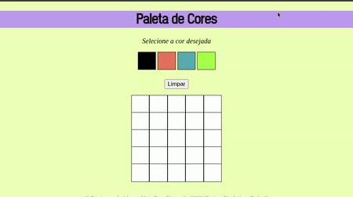

Projeto do Bloco 5 do módulo de Fundamentos do curso de Desenvolvimento Web da Trybe.

'Pixels Art' foi um grande desafio para mim, pois, pela primeira vez, precisei combinar os conhecimentos em HTML e CSS com implementações de JavaScript DOM para que fosse possível acrescentar interatividade aos elementos da tela. A solução desenvolvida por mim se encontra nos arquivos index.html, style.css e script.js.

🈂️ In this repository, you will find my 'Pixels Art' project, which I developed during the Module 1 (Web Fundamentals) of my Web Dev. course at Trybe. To me, at the time, it was a real challenge, because it was the first time I had to combine HTML and CSS with JS DOM to make this web page interactive. Check out my full code solutions by acessing the files index.html, style.css and script.js. In the following GIF, you can check the web page preview of the final result. 

Abaixo, apresento uma prévia do resultado final do projeto:

---
